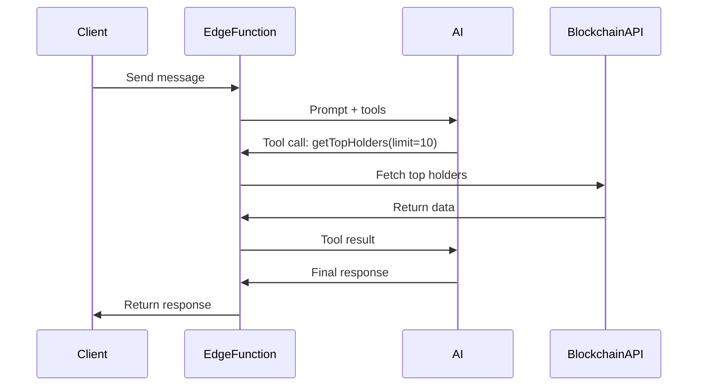
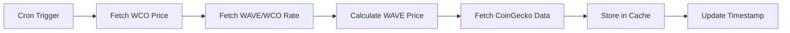
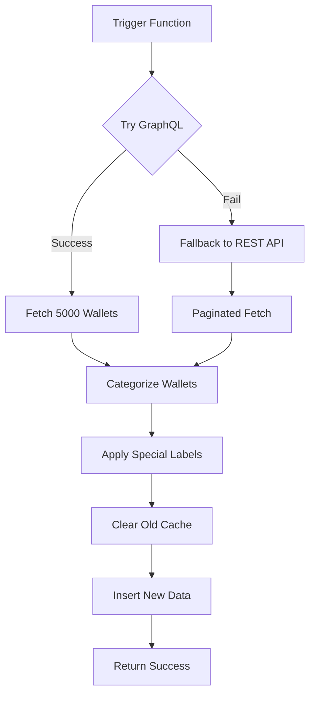

# Edge Functions API Reference

This document provides detailed API documentation for all Supabase Edge Functions in the W Chain Ocean Analytics platform.

---

## Table of Contents

1. [chat-wchain](#chat-wchain) - AI Chatbot
2. [telegram-bot](#telegram-bot) - Telegram Integration
3. [price-collector](#price-collector) - Price Aggregation
4. [daily-snapshot](#daily-snapshot) - Daily Metrics
5. [refresh-leaderboard-cache](#refresh-leaderboard-cache) - Cache Refresh
6. [og88-price-proxy](#og88-price-proxy) - OG88 Price

---

## chat-wchain

### Overview

AI-powered blockchain assistant with tool-calling capabilities. Provides natural language access to 25+ blockchain data tools using Google Gemini models.

### Endpoint

```
POST https://your-project.supabase.co/functions/v1/chat-wchain
```

### Authentication

✅ **Required** - JWT token in `Authorization` header

```bash
Authorization: Bearer <supabase-jwt-token>
```

### Rate Limiting

**20 requests per minute per user** (in-memory rate limit)

### Request Schema

```typescript
{
  messages: Array<{
    role: 'user' | 'assistant',
    content: string
  }>,
  conversationId: string | null,  // UUID or null for new conversation
  sessionId: string                // Client-generated session ID
}
```

### Request Example

```bash
curl -X POST https://your-project.supabase.co/functions/v1/chat-wchain \
  -H "Authorization: Bearer YOUR_JWT_TOKEN" \
  -H "Content-Type: application/json" \
  -d '{
    "messages": [
      {
        "role": "user",
        "content": "What is the current WCO price?"
      }
    ],
    "conversationId": null,
    "sessionId": "client-session-123"
  }'
```

### Response Schema

```typescript
{
  response: string,           // AI assistant's response
  conversationId: string,     // UUID of the conversation
  sessionId: string           // Echo of the session ID
}
```

### Response Example

```json
{
  "response": "The current WCO price is $0.001234 USD. The price has increased by 5.2% in the last 24 hours.",
  "conversationId": "550e8400-e29b-41d4-a716-446655440000",
  "sessionId": "client-session-123"
}
```

### Error Responses

| Status Code | Error | Description |
|-------------|-------|-------------|
| 401 | Unauthorized | Missing or invalid JWT token |
| 429 | Rate Limit Exceeded | More than 20 requests in 1 minute |
| 400 | Invalid Request | Malformed request body |
| 500 | Internal Server Error | Edge function error |

### Available AI Tools

The AI assistant has access to 25+ blockchain data tools:

#### Search & Discovery

**1. searchBlockchain**
- Search for transactions, blocks, addresses, or tokens
- Parameters: `query` (string)

**2. getNetworkStats**
- Get current network statistics and counters
- No parameters

**3. getBlockInfo**
- Get detailed information about a specific block
- Parameters: `blockNumberOrHash` (string)

**4. getRecentBlocks**
- Get list of recent blocks
- Parameters: `limit` (number, default: 10)

#### Transactions

**5. getTransactionDetails**
- Get comprehensive transaction details
- Parameters: 
  - `txHash` (string, required)
  - `includeTokenTransfers` (boolean, default: true)
  - `includeInternalTxs` (boolean, default: false)
  - `includeLogs` (boolean, default: false)

**6. getRecentTransactions**
- Get recent transactions with filters
- Parameters:
  - `limit` (number, default: 20)
  - `minValue` (number, optional)
  - `hours` (number, optional)

**7. getTransactionStatus**
- Get transaction execution status
- Parameters: `txHash` (string)

**8. getTransactionCharts**
- Get transaction volume charts over time
- No parameters

#### Wallets & Addresses

**9. getAddressInfo**
- Get comprehensive wallet information
- Parameters:
  - `address` (string, required)
  - `includeTransactions` (boolean, default: false)
  - `includeTokens` (boolean, default: true)
  - `includeNFTs` (boolean, default: false)

**10. getTopHolders**
- Get top WCO holders with categorization
- Parameters:
  - `limit` (number, default: 50)
  - `category` (string, optional): "Kraken", "Whale", "Shark", "Dolphin", "Fish", "Octopus", "Crab", "Shrimp", "Plankton"

**11. getHolderDistribution**
- Analyze holder distribution by category
- No parameters

**12. getMultipleBalances**
- Get WCO balances for multiple addresses
- Parameters: `addresses` (array, max 20)

#### Tokens

**13. getTokensList**
- Get list of all tokens on W-Chain
- Parameters: `tokenType` (string, optional): "ERC-20", "ERC-721", "ERC-1155"

**14. getTokenInfo**
- Get detailed token information
- Parameters: `tokenAddress` (string)

**15. getTokenHolders**
- Get list of token holders
- Parameters:
  - `tokenAddress` (string, required)
  - `limit` (number, default: 50)

**16. getTokenTransfers**
- Get token transfers for an address
- Parameters:
  - `address` (string, required)
  - `tokenType` (string, default: "ERC-20")
  - `startBlock` (number, optional)
  - `endBlock` (number, optional)
  - `page` (number, default: 1)
  - `offset` (number, default: 100)

**17. getTokenPrice**
- Get real-time USD price for tokens
- Parameters: `symbol` (string): "WCO" or "WAVE"

#### Supply & Economics

**18. getSupplyInfo**
- Get WCO token supply breakdown
- Returns: total supply, circulating supply, locked supply, burned tokens
- No parameters

**19. getDailyMetrics**
- Get historical daily metrics
- Parameters: `days` (number, default: 7)

#### Smart Contracts

**20. getSmartContracts**
- Get list of verified smart contracts
- Parameters: `limit` (number, default: 20)

**21. getContractInfo**
- Get verified contract source code and ABI
- Parameters: `address` (string)

**22. getContractLogs**
- Query contract event logs
- Parameters:
  - `address` (string, required)
  - `fromBlock` (number, optional)
  - `toBlock` (number, optional)
  - `topic0` (string, optional)
  - `page` (number, default: 1)
  - `offset` (number, default: 100, max: 1000)

**23. getBlockReward**
- Get block mining reward information
- Parameters: `blockNumber` (number)

### Model Selection

The edge function dynamically selects the appropriate AI model:

| Model | Use Case |
|-------|----------|
| `google/gemini-2.5-flash` | Simple queries, fast responses |
| `google/gemini-2.5-pro` | Complex reasoning, multiple tool calls |

**Selection Criteria:**
- Query complexity (length, keywords like "why", "analyze", "compare")
- Tool usage likelihood
- Need for reasoning and multi-step problem solving

### Conversation History

- The function maintains conversation context by loading previous messages
- Maximum **12 prior messages** are included in the AI prompt
- Conversations are linked to users via `user_id` and sessions via `session_id`

### Tool Execution Flow



---

## telegram-bot

### Overview

Telegram bot webhook integration for blockchain data queries via Telegram messaging app.

### Endpoint

```
POST https://your-project.supabase.co/functions/v1/telegram-bot
```

### Authentication

⚠️ **None** - Public webhook endpoint

**Security Note:** Should implement Telegram webhook signature verification in the future.

### Telegram Webhook Setup

```bash
curl "https://api.telegram.org/bot<YOUR_BOT_TOKEN>/setWebhook?url=https://your-project.supabase.co/functions/v1/telegram-bot"
```

### Request Schema (Telegram Update Object)

```typescript
{
  update_id: number,
  message: {
    message_id: number,
    from: {
      id: number,
      username: string,
      first_name: string
    },
    chat: {
      id: number,
      type: string
    },
    text: string,
    date: number
  }
}
```

### Supported Commands

| Command | Description | Example |
|---------|-------------|---------|
| `/start` | Welcome message | `/start` |
| `/price` | Get WCO price | `/price` |
| `/balance <address>` | Get wallet balance | `/balance 0x123...` |
| `/stats` | Network statistics | `/stats` |
| `/holders` | Top holder info | `/holders` |

### Response Format

The bot sends responses back to Telegram using the Telegram Bot API:

```typescript
await fetch(`https://api.telegram.org/bot${BOT_TOKEN}/sendMessage`, {
  method: 'POST',
  headers: { 'Content-Type': 'application/json' },
  body: JSON.stringify({
    chat_id: message.chat.id,
    text: "Response message",
    parse_mode: 'Markdown'
  })
});
```

### Error Handling

- Invalid addresses return user-friendly error messages
- API failures are caught and logged
- Users receive "Something went wrong" messages on errors

---

## price-collector

### Overview

Scheduled edge function that aggregates price data from multiple sources (W-Chain API, CoinGecko, DEX).

### Trigger

**Cron Schedule:** Every 5 minutes

```
0 */5 * * * *
```

### Authentication

🔒 **Internal** - Triggered by Supabase scheduler (no external access)

### Data Sources

1. **W-Chain Price API** - Primary WCO price
2. **WSwap Reserves** - WAVE/WCO trading pair rate
3. **CoinGecko API** - Market data (volume, ATH, price changes)

### Process Flow



### Output

Data is cached in the edge function's internal cache and potentially stored in the database for historical tracking.

### Monitoring

Check Supabase Edge Function logs:
```bash
supabase functions logs price-collector
```

---

## daily-snapshot

### Overview

Captures daily network metrics for historical trend analysis and comparison.

### Trigger

**Cron Schedule:** Daily at midnight UTC

```
0 0 * * * *
```

### Authentication

🔒 **Internal** - Triggered by Supabase scheduler

### Collected Metrics

```typescript
{
  snapshot_date: string,          // YYYY-MM-DD
  total_holders: number,
  total_supply_wco: number,
  circulating_supply_wco: number,
  locked_supply_wco: number,
  burned_wco: number,
  market_cap: number,
  transactions_24h: number,
  active_wallets_24h: number,
  top_holder_balance: number,
  average_holder_balance: number
}
```

### Database Storage

```sql
INSERT INTO daily_snapshots (
  snapshot_date,
  total_holders,
  total_supply_wco,
  circulating_supply_wco,
  market_cap,
  transactions_24h,
  ...
) VALUES (...);
```

### Usage

Daily snapshots enable:
- Trend charts (growth over time)
- Day-over-day comparisons
- Historical analysis
- Report generation

### Query Example

```typescript
const { data } = await supabase
  .from('daily_snapshots')
  .select('*')
  .order('snapshot_date', { ascending: false })
  .limit(30);
```

---

## refresh-leaderboard-cache

### Overview

Refreshes the wallet leaderboard cache by fetching the latest wallet data from W-Chain APIs.

### Endpoint

```
POST https://your-project.supabase.co/functions/v1/refresh-leaderboard-cache
```

### Authentication

⚠️ **None** - Currently public access

**Security Note:** Should add authentication or convert to cron-only trigger.

### Process Flow



### Wallet Categorization

| Category | Emoji | Min Balance | Max Balance |
|----------|-------|-------------|-------------|
| Flagship | 🚩 | - | - |
| Harbor (Exchanges) | ⚓ | - | - |
| Bridge/Wrapped | 🌉 | - | - |
| Kraken | 🦑 | 5,000,000 | - |
| Whale | 🐋 | 1,000,001 | 4,999,999 |
| Shark | 🦈 | 500,001 | 1,000,000 |
| Dolphin | 🐬 | 100,001 | 500,000 |
| Fish | 🐟 | 50,001 | 100,000 |
| Octopus | 🐙 | 10,001 | 50,000 |
| Crab | 🦀 | 1,001 | 10,000 |
| Shrimp | 🦐 | 1 | 1,000 |
| Plankton | 🦠 | 0 | 0.999 |

### Special Wallet Labels

**Flagship Wallets (Team):**
- Validation Nodes
- Liquidity Provision
- Marketing & Community
- Treasury Wallet
- Buybacks
- (14 total)

**Exchange Wallets (Harbor):**
- MEXC Exchange
- BitMart Exchange
- Bitrue Exchange

**Wrapped Contracts:**
- Wrapped WCO Contract

### Request Example

```bash
curl -X POST https://your-project.supabase.co/functions/v1/refresh-leaderboard-cache
```

### Response Example

```json
{
  "success": true,
  "walletsProcessed": 5000,
  "cacheUpdated": true
}
```

### Cache Duration

Recommended refresh: **Every 15 minutes**

Frontend React Query cache: **15 minutes stale time**

---

## og88-price-proxy

### Overview

Fetches the real-time price of the OG88 token from the WSwap decentralized exchange.

### Endpoint

```
GET https://your-project.supabase.co/functions/v1/og88-price-proxy
```

### Authentication

✅ **Public** - Read-only data, no authentication required

### Process

1. Query WSwap liquidity pool for OG88/WCO pair
2. Extract reserve balances
3. Calculate price ratio
4. Multiply by WCO USD price
5. Return OG88 USD price

### Request Example

```bash
curl https://your-project.supabase.co/functions/v1/og88-price-proxy
```

### Response Schema

```typescript
{
  price: number,           // OG88 price in USD
  wcoPrice: number,        // WCO price in USD
  og88Reserve: number,     // OG88 in pool
  wcoReserve: number,      // WCO in pool
  ratio: number,           // OG88/WCO ratio
  timestamp: string        // ISO 8601 timestamp
}
```

### Response Example

```json
{
  "price": 0.00045,
  "wcoPrice": 0.00123,
  "og88Reserve": 1000000,
  "wcoReserve": 365853,
  "ratio": 0.365853,
  "timestamp": "2025-10-23T12:34:56Z"
}
```

### Error Responses

| Status Code | Error | Description |
|-------------|-------|-------------|
| 500 | Pool Data Unavailable | WSwap pool data cannot be fetched |
| 503 | Service Unavailable | W-Chain API is down |

### Caching

**Client-side:** 1 minute (React Query)

**Edge function:** No caching (real-time data)

---

## Common Patterns

### Error Handling

All edge functions return errors in this format:

```json
{
  "error": "Error message",
  "details": "Additional details (optional)"
}
```

### CORS Headers

All functions include CORS headers:

```typescript
const corsHeaders = {
  'Access-Control-Allow-Origin': '*',
  'Access-Control-Allow-Headers': 'authorization, x-client-info, apikey, content-type',
};
```

### Request Validation (Zod)

Input validation using Zod schemas:

```typescript
import { z } from 'zod';

const schema = z.object({
  address: z.string().regex(/^0x[a-fA-F0-9]{40}$/)
});

const result = schema.safeParse(requestBody);
if (!result.success) {
  return new Response(JSON.stringify({ error: 'Invalid input' }), {
    status: 400,
    headers: { 'Content-Type': 'application/json' }
  });
}
```

### Logging

Use `console.log()` and `console.error()` for logging:

```typescript
console.log('Processing request:', requestBody);
console.error('Error fetching data:', error);
```

View logs:
```bash
supabase functions logs <function-name>
```

---

## Testing Edge Functions

### Local Testing

```bash
# Start Supabase locally
supabase start

# Serve edge functions
supabase functions serve

# Test with curl
curl -X POST http://localhost:54321/functions/v1/chat-wchain \
  -H "Authorization: Bearer <local-anon-key>" \
  -d '{"messages": [{"role": "user", "content": "test"}], "sessionId": "test"}'
```

### Production Testing

Use the project URL:

```bash
curl https://your-project.supabase.co/functions/v1/chat-wchain \
  -H "Authorization: Bearer <production-jwt>" \
  -d '<request-body>'
```

---

*Last updated: 2025-10-23*
