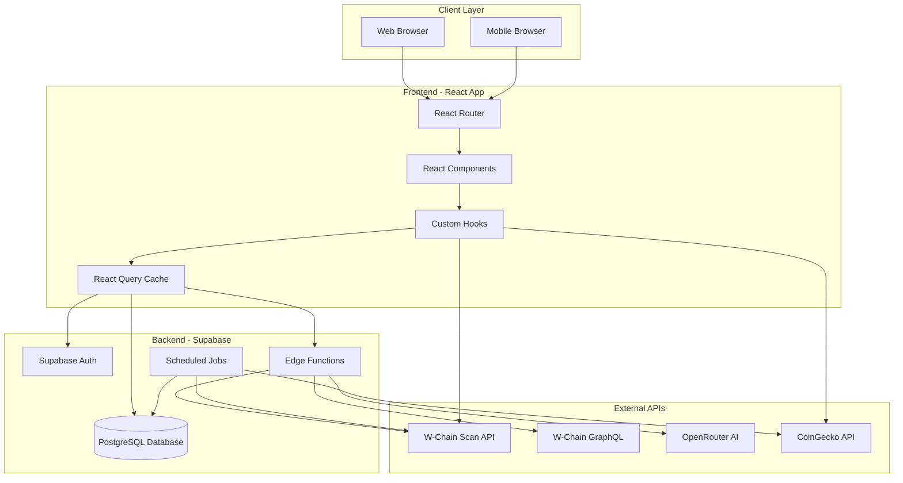
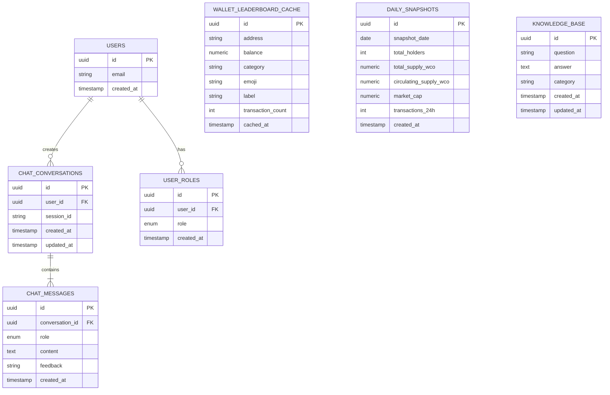
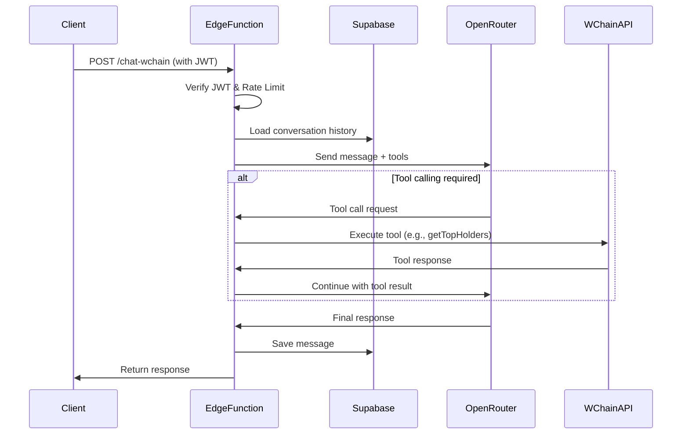
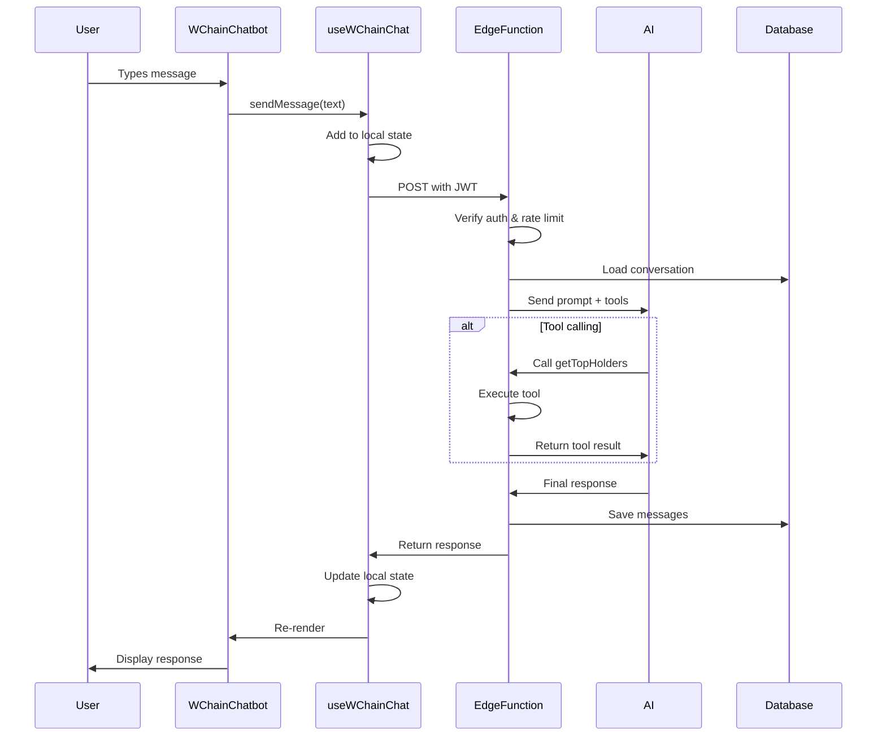
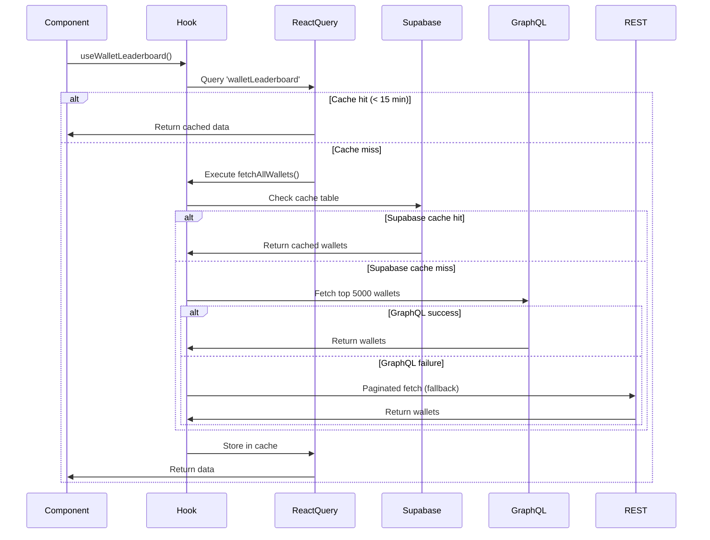
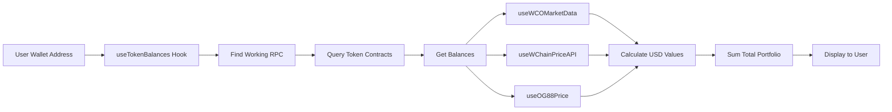
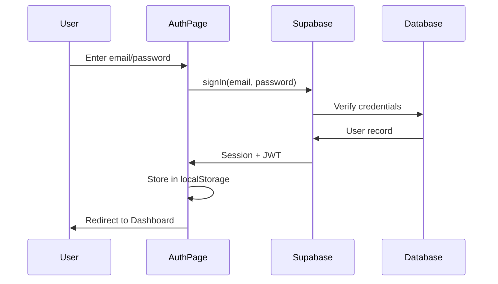

# W Chain Ocean Analytics - System Architecture

This document provides a comprehensive overview of the system architecture, data flow, and technical design decisions.

## 📋 Table of Contents

1. [High-Level Architecture](#high-level-architecture)
2. [Frontend Architecture](#frontend-architecture)
3. [Backend Architecture](#backend-architecture)
4. [Data Flow](#data-flow)
5. [External Integrations](#external-integrations)
6. [Authentication & Authorization](#authentication--authorization)
7. [Caching Strategy](#caching-strategy)
8. [Performance Optimizations](#performance-optimizations)

---

## High-Level Architecture



### Key Components

1. **Frontend Layer** - React SPA with TypeScript
2. **Backend Layer** - Supabase (PostgreSQL + Edge Functions)
3. **Data Sources** - W-Chain APIs, CoinGecko, OpenRouter
4. **Caching** - Multi-tier (Browser, React Query, Database)

---

## Frontend Architecture

### Component Hierarchy

```
App.tsx
├── Router (React Router)
│   ├── Auth.tsx (Login/Signup)
│   ├── Dashboard.tsx
│   │   ├── DashboardLayout
│   │   │   ├── OceanSidebar
│   │   │   └── WChainChatbot
│   │   ├── CryptoMetricCard (x4)
│   │   ├── WavePriceChart
│   │   ├── WalletLeaderboard
│   │   └── TokenList
│   ├── Portfolio.tsx
│   │   ├── PortfolioSummary
│   │   ├── TokenHoldings
│   │   ├── PnLWidget
│   │   └── PortfolioPerformanceChart
│   ├── Tokens.tsx
│   │   ├── TokenSearch
│   │   ├── TokenList
│   │   └── AddCustomTokenForm
│   ├── WSwap.tsx
│   │   ├── PriceChart
│   │   ├── WSwapTrades
│   │   └── TradingViewWidget
│   └── WcoInfo.tsx
│       ├── TokenStats
│       ├── WCOBurnTracker
│       └── WCOSupplyInfo
└── Toaster (Notifications)
```

### State Management Strategy

**React Query (TanStack Query)** is used as the primary state management solution:

- **Query Keys:** Hierarchical naming (e.g., `['walletLeaderboard']`, `['tokenBalances', address]`)
- **Stale Time:** 15 minutes for leaderboard, 5 minutes for prices
- **Cache Time:** 30 minutes garbage collection
- **Refetch Behavior:** On window focus for real-time data

**Context API** is used for:
- Authentication state (`AuthContext`)
- User session management
- Admin role checking

**Local State (useState)** for:
- Component-specific UI state
- Form inputs
- Toggle states

### Routing Structure

```typescript
const routes = [
  { path: '/', element: <Dashboard /> },
  { path: '/auth', element: <Auth /> },
  { path: '/portfolio', element: <Portfolio /> },
  { path: '/tokens', element: <Tokens /> },
  { path: '/wswap', element: <WSwap /> },
  { path: '/wco-info', element: <WcoInfo /> },
  { path: '/wave', element: <Wave /> },
  { path: '/admin/knowledge', element: <AdminKnowledge /> }, // Admin only
  { path: '/admin/cache', element: <AdminCache /> }, // Admin only
  { path: '*', element: <NotFound /> }
];
```

Protected routes use `<ProtectedRoute>` wrapper component.

---

## Backend Architecture

### Database Schema



### Edge Functions

#### 1. `chat-wchain` - AI Chatbot

**Purpose:** AI-powered blockchain assistant with tool-calling capabilities

**Authentication:** JWT required (`verify_jwt = true`)

**Rate Limiting:** In-memory rate limit (20 req/min per user)

**Architecture:**


**Available Tools (25+):**
- Blockchain search (transactions, blocks, addresses)
- Network statistics
- Wallet analysis (top holders, distribution)
- Token information (holders, transfers, supply)
- Price feeds (WCO, WAVE)
- Smart contract inspection
- Historical metrics

**Dynamic Model Selection:**
- **Gemini 2.5 Flash** - Fast responses for simple queries
- **Gemini 2.5 Pro** - Complex reasoning and tool-heavy queries

#### 2. `price-collector` - Price Aggregation

**Schedule:** Every 5 minutes (cron)

**Purpose:** Aggregate price data from multiple sources

**Flow:**
1. Fetch WCO price from W-Chain API
2. Fetch WAVE/WCO rate from WSwap
3. Calculate WAVE USD price
4. Fetch CoinGecko data (volume, ATH)
5. Cache results in database

#### 3. `daily-snapshot` - Metrics Collection

**Schedule:** Daily at midnight UTC

**Purpose:** Capture daily network metrics for trend analysis

**Collected Metrics:**
- Total holders count
- Total supply (WCO)
- Circulating supply
- Market cap
- 24h transaction count
- Locked supply (validators, vesting)
- Burned tokens

#### 4. `refresh-leaderboard-cache`

**Trigger:** Manual or scheduled

**Purpose:** Refresh wallet leaderboard cache

**Process:**
1. Try GraphQL API (bulk fetch top 5000 wallets)
2. Fallback to REST API (paginated)
3. Categorize wallets (Kraken, Whale, Shark, etc.)
4. Apply special labels (Flagship, Harbor, Bridge)
5. Insert into `wallet_leaderboard_cache`

#### 5. `telegram-bot`

**Purpose:** Telegram bot webhook integration

**Features:**
- Wallet balance lookup
- Price queries
- Network stats
- Transaction search

**Security Note:** Currently lacks signature verification (planned improvement)

#### 6. `og88-price-proxy`

**Purpose:** Fetch OG88 token price from DEX

**Process:**
1. Query WSwap liquidity pool
2. Calculate price from reserves
3. Return USD value

---

## Data Flow

### Example: Chat Message Flow



### Example: Wallet Leaderboard Data Flow



### Example: Portfolio Value Calculation



---

## External Integrations

### 1. W-Chain Scan REST API

**Base URL:** `https://scan.w-chain.com/api/v2`

**Key Endpoints:**
- `/addresses` - Wallet data (balance, tx count)
- `/transactions` - Transaction details
- `/tokens` - Token information
- `/search` - Universal search
- `/stats` - Network statistics

**Rate Limits:** None officially documented, but we add delays to avoid overwhelming

**Caching:** 15 minutes for leaderboard, 5 minutes for prices

### 2. W-Chain GraphQL API

**Endpoint:** `https://scan.w-chain.com/api/graphql`

**Advantages:**
- Bulk queries (up to 5000 wallets in one request)
- Faster than REST pagination
- Structured data with types

**Limitations:**
- Sometimes unreliable (fallback to REST required)
- Not all data available via GraphQL

**Usage Example:**
```graphql
query NetworkStats($limit: Int!) {
  addresses(first: $limit, orderBy: COIN_BALANCE_DESC) {
    items {
      hash
      coinBalance
      transactionsCount
    }
  }
}
```

### 3. OpenRouter AI

**Purpose:** LLM gateway for multiple AI models

**Base URL:** `https://openrouter.ai/api/v1/chat/completions`

**Models Used:**
- `google/gemini-2.5-flash` - Fast responses
- `google/gemini-2.5-pro` - Complex reasoning

**Features:**
- Function calling (tool use)
- Streaming responses (not used currently)
- Multi-model fallback

**Cost:** Pay-per-use (credits)

### 4. CoinGecko API

**Purpose:** Market data (volume, ATH, price changes)

**Endpoint:** `https://api.coingecko.com/api/v3/coins/markets`

**Token ID:** `wadzcoin`

**Rate Limits:** Free tier - 50 calls/min

**Caching:** 5 minutes client-side

---

## Authentication & Authorization

### Authentication Flow



### Protected Routes

```typescript
<ProtectedRoute>
  <AdminKnowledge />
</ProtectedRoute>
```

**Implementation:**
1. Check if user is authenticated (Supabase session)
2. Redirect to `/auth` if not authenticated
3. Optionally check user role (e.g., admin)

### Role-Based Access Control (RBAC)

**Roles:**
- `admin` - Full access to admin pages and knowledge base management

**Database:**
```sql
CREATE TABLE user_roles (
  id UUID PRIMARY KEY,
  user_id UUID REFERENCES auth.users(id),
  role app_role NOT NULL
);

CREATE TYPE app_role AS ENUM ('admin');
```

**Function:**
```sql
CREATE FUNCTION has_role(_user_id UUID, _role app_role)
RETURNS BOOLEAN AS $$
  SELECT EXISTS (
    SELECT 1 FROM public.user_roles
    WHERE user_id = _user_id AND role = _role
  )
$$ LANGUAGE SQL STABLE SECURITY DEFINER;
```

### Row Level Security (RLS) Policies

**Example: Chat Messages**
```sql
-- Users can only see their own messages
CREATE POLICY "Users can view own messages"
ON chat_messages FOR SELECT
USING (
  conversation_id IN (
    SELECT id FROM chat_conversations
    WHERE user_id = auth.uid()
  )
);
```

---

## Caching Strategy

### Multi-Tier Caching

```
┌─────────────────┐
│  Browser Cache  │ (Fastest, but can be cleared)
└────────┬────────┘
         │
┌────────▼────────┐
│ React Query     │ (15-30 min stale/gc time)
└────────┬────────┘
         │
┌────────▼────────┐
│ Supabase DB     │ (15 min TTL on leaderboard)
└────────┬────────┘
         │
┌────────▼────────┐
│ External APIs   │ (Source of truth)
└─────────────────┘
```

### Cache Invalidation

**Automatic:**
- React Query refetches on window focus (configurable)
- Stale time expiration triggers background refetch
- Database cache refreshed by scheduled edge function

**Manual:**
- Refresh buttons trigger `refetch()` in React Query
- Admin can manually trigger cache refresh via API

### RPC Endpoint Caching

```typescript
let cachedRPC: { url: string; timestamp: number } | null = null;
const RPC_CACHE_DURATION = 5 * 60 * 1000; // 5 minutes

// Reuse working RPC for 5 minutes to avoid connection overhead
```

---

## Performance Optimizations

### 1. Code Splitting

**Route-based splitting:**
```typescript
const Dashboard = lazy(() => import('./pages/Dashboard'));
const Portfolio = lazy(() => import('./pages/Portfolio'));
```

### 2. React Query Configuration

```typescript
const queryClient = new QueryClient({
  defaultOptions: {
    queries: {
      staleTime: 5 * 60 * 1000,     // 5 minutes
      gcTime: 30 * 60 * 1000,        // 30 minutes
      refetchOnWindowFocus: true,
      retry: 2,
    },
  },
});
```

### 3. Debounced API Calls

**Token balance fetching:**
- Sequential processing (not parallel) to avoid RPC overload
- 200ms delay between requests
- 2s delay every 5 requests
- Exponential backoff on failures

### 4. GraphQL Over REST

**Leaderboard fetching:**
- GraphQL: 1 request for 5000 wallets (~2s)
- REST: 50 requests for 5000 wallets (~25s with delays)

**95% reduction in requests and latency**

### 5. Database Indexing

```sql
CREATE INDEX idx_wallet_balance ON wallet_leaderboard_cache(balance DESC);
CREATE INDEX idx_chat_conversation ON chat_messages(conversation_id);
CREATE INDEX idx_snapshot_date ON daily_snapshots(snapshot_date DESC);
```

### 6. Edge Function In-Memory Cache

```typescript
const cache = new Map<string, { data: any; timestamp: number }>();

function getCached(key: string, ttl: number) {
  const c = cache.get(key);
  return c && Date.now() - c.timestamp < ttl ? c.data : null;
}
```

---

## Security Considerations

### 1. JWT Verification on Edge Functions

All user-facing edge functions (e.g., `chat-wchain`) have `verify_jwt = true` in `supabase/config.toml`.

### 2. Rate Limiting

```typescript
// In-memory rate limit (20 req/min per user)
const rateLimitMap = new Map<string, number[]>();

function checkRateLimit(userId: string): boolean {
  const now = Date.now();
  const timestamps = rateLimitMap.get(userId) || [];
  const recentRequests = timestamps.filter(t => now - t < 60000);
  
  if (recentRequests.length >= 20) {
    return false; // Rate limit exceeded
  }
  
  recentRequests.push(now);
  rateLimitMap.set(userId, recentRequests);
  return true;
}
```

### 3. Input Validation (Zod)

```typescript
const requestSchema = z.object({
  messages: z.array(z.object({
    role: z.enum(['user', 'assistant']),
    content: z.string()
  })),
  conversationId: z.string().uuid().nullable(),
  sessionId: z.string()
});
```

### 4. RLS Policies

All sensitive tables (chat data, user roles) are protected by Row Level Security policies.

### 5. Environment Variable Security

Secrets stored in Supabase Edge Function secrets (encrypted at rest).

---

## Future Improvements

### Planned Enhancements

1. **WebSocket Support** - Real-time price updates without polling
2. **AI Streaming Responses** - Show AI responses as they're generated
3. **Telegram Bot Signature Verification** - Verify webhook authenticity
4. **GraphQL Subscriptions** - Real-time database updates
5. **Service Worker** - Offline support and faster load times
6. **Distributed Rate Limiting** - Redis-based rate limiting across instances
7. **Advanced Analytics** - User behavior tracking and AI conversation analysis
8. **Multi-Language Support** - i18n for global users

---

*Last updated: 2025-10-23*
