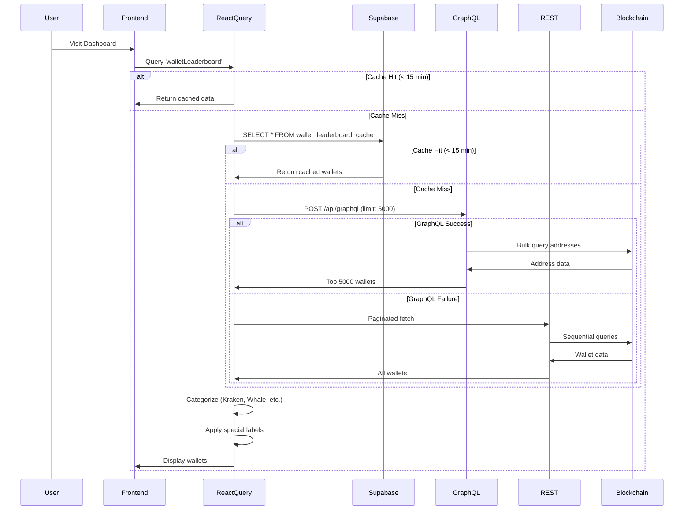
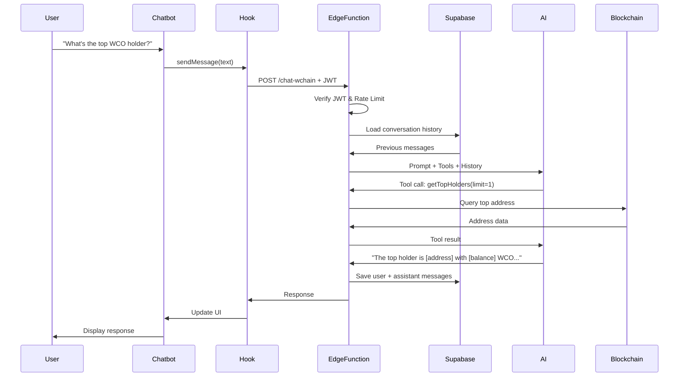
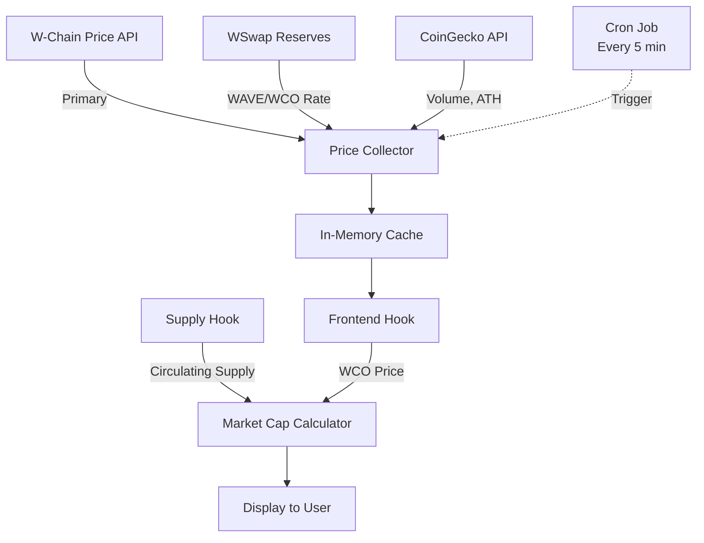

# System Architecture & Smart Contract Logic

## Table of Contents
1. [Overview](#overview)
2. [Architecture Layers](#architecture-layers)
3. [Smart Contract Integration](#smart-contract-integration)
4. [Data Flow](#data-flow)
5. [Token Economics](#token-economics)
6. [Security Model](#security-model)

---

## Overview

W Chain Ocean Analytics is a full-stack blockchain analytics platform built on the W-Chain EVM-compatible blockchain. The system provides real-time insights into wallet activities, token economics, and network statistics through a multi-layered architecture.

### Key Components

```
┌─────────────────────────────────────────────────────────────┐
│                     Frontend Layer                           │
│  React + TypeScript + TailwindCSS + shadcn/ui               │
└─────────────────────────────────────────────────────────────┘
                            ↓
┌─────────────────────────────────────────────────────────────┐
│                   Application Layer                          │
│  React Query Cache + Context API + Custom Hooks             │
└─────────────────────────────────────────────────────────────┘
                            ↓
┌─────────────────────────────────────────────────────────────┐
│                    Backend Layer                             │
│  Supabase (PostgreSQL + Edge Functions + Auth)              │
└─────────────────────────────────────────────────────────────┘
                            ↓
┌─────────────────────────────────────────────────────────────┐
│                  Blockchain Layer                            │
│  W-Chain RPC + Smart Contracts + Block Explorer API         │
└─────────────────────────────────────────────────────────────┘
```

---

## Architecture Layers

### 1. Presentation Layer

**Technology:** React 18.3 with TypeScript

**Components:**
- **WChainChatbot** - AI-powered assistant UI
- **WalletLeaderboard** - Tiered wallet display (Ocean Creatures)
- **TokenList** - ERC-20/721/1155 token explorer
- **PriceChart** - Real-time price visualization
- **PortfolioSummary** - Multi-token portfolio analytics

**Design System:**
- Ocean-themed gradients and animations
- Semantic color tokens (HSL-based)
- Responsive breakpoints (mobile, tablet, desktop)
- Dark/light mode support

### 2. State Management Layer

**Primary: React Query (TanStack Query)**

```typescript
// Query configuration
{
  staleTime: 15 * 60 * 1000,     // 15 minutes
  gcTime: 30 * 60 * 1000,        // 30 minutes garbage collection
  refetchOnWindowFocus: true,    // Keep data fresh
  retry: 2                       // Retry failed requests
}
```

**Cache Hierarchy:**
1. **Browser Memory** (React Query) - Fastest, session-based
2. **Supabase Database** - Persistent, 15-min TTL
3. **External APIs** - Source of truth

**Context API Usage:**
- `AuthContext` - User session and authentication
- Admin role checking
- Session persistence

### 3. Business Logic Layer

**Custom Hooks Architecture:**

```typescript
// Data fetching hook pattern
export const useWalletLeaderboard = () => {
  return useQuery({
    queryKey: ['walletLeaderboard'],
    queryFn: async () => {
      // 1. Try Supabase cache
      const cached = await fetchFromCache();
      if (cached) return cached;
      
      // 2. Try GraphQL (bulk fetch)
      const graphQLData = await fetchViaGraphQL();
      if (graphQLData) return graphQLData;
      
      // 3. Fallback to REST API
      return await fetchViaREST();
    },
    staleTime: 15 * 60 * 1000
  });
};
```

**Key Hooks:**
- `useWalletLeaderboard` - Three-tier data fetching
- `useTokenBalances` - RPC endpoint discovery with fallbacks
- `useWChainChat` - AI conversation management
- `useWCOMarketData` - Multi-source price aggregation
- `useWSwapTrades` - DEX analytics

### 4. Backend Layer (Supabase)

**Database Schema:**

```sql
-- Chat system
CREATE TABLE chat_conversations (
  id UUID PRIMARY KEY,
  user_id UUID REFERENCES auth.users(id),
  session_id TEXT NOT NULL,
  created_at TIMESTAMP WITH TIME ZONE DEFAULT NOW()
);

CREATE TABLE chat_messages (
  id UUID PRIMARY KEY,
  conversation_id UUID REFERENCES chat_conversations(id),
  role TEXT NOT NULL, -- 'user' or 'assistant'
  content TEXT NOT NULL,
  feedback TEXT, -- 'positive' or 'negative'
  created_at TIMESTAMP WITH TIME ZONE DEFAULT NOW()
);

-- Leaderboard cache
CREATE TABLE wallet_leaderboard_cache (
  id UUID PRIMARY KEY,
  address TEXT NOT NULL UNIQUE,
  balance NUMERIC NOT NULL,
  category TEXT NOT NULL,
  emoji TEXT NOT NULL,
  label TEXT,
  transaction_count INTEGER,
  cached_at TIMESTAMP WITH TIME ZONE DEFAULT NOW()
);

-- Daily snapshots
CREATE TABLE daily_snapshots (
  id UUID PRIMARY KEY,
  snapshot_date DATE NOT NULL UNIQUE,
  total_holders INTEGER,
  total_supply_wco NUMERIC,
  circulating_supply_wco NUMERIC,
  market_cap NUMERIC,
  transactions_24h INTEGER,
  created_at TIMESTAMP WITH TIME ZONE DEFAULT NOW()
);

-- Knowledge base
CREATE TABLE knowledge_base (
  id UUID PRIMARY KEY,
  question TEXT NOT NULL,
  answer TEXT NOT NULL,
  category TEXT,
  created_at TIMESTAMP WITH TIME ZONE DEFAULT NOW()
);

-- User roles
CREATE TABLE user_roles (
  id UUID PRIMARY KEY,
  user_id UUID REFERENCES auth.users(id),
  role app_role NOT NULL,
  created_at TIMESTAMP WITH TIME ZONE DEFAULT NOW()
);

CREATE TYPE app_role AS ENUM ('admin');
```

**Row Level Security (RLS):**

```sql
-- Users can only see their own conversations
CREATE POLICY "Users view own conversations"
ON chat_conversations FOR SELECT
USING (auth.uid() = user_id);

-- Leaderboard cache is publicly readable
CREATE POLICY "Leaderboard public read"
ON wallet_leaderboard_cache FOR SELECT
USING (true);

-- Admin-only access to knowledge base
CREATE POLICY "Admin manage knowledge"
ON knowledge_base FOR ALL
USING (
  EXISTS (
    SELECT 1 FROM user_roles
    WHERE user_id = auth.uid() AND role = 'admin'
  )
);
```

**Edge Functions:**

1. **chat-wchain** (Deno runtime)
```typescript
// AI agent with tool calling
const tools = [
  searchBlockchain,
  getNetworkStats,
  getTopHolders,
  getTokenInfo,
  getSupplyInfo,
  // ... 20+ more tools
];

const response = await openrouter.chat.completions.create({
  model: chooseModel(userMessage), // gemini-2.5-pro or flash
  messages: conversationHistory,
  tools: tools
});
```

2. **price-collector** (Scheduled)
```typescript
// Cron: Every 5 minutes
const wcoPrice = await fetchWChainPrice();
const waveRate = await fetchWSwapRate();
const geckoData = await fetchCoinGeckoData();
await updateCache({ wcoPrice, waveRate, geckoData });
```

3. **daily-snapshot** (Scheduled)
```typescript
// Cron: Daily at midnight UTC
const metrics = {
  totalHolders: await countHolders(),
  supply: await calculateSupply(),
  marketCap: await calculateMarketCap(),
  transactions24h: await count24hTransactions()
};
await insertSnapshot(metrics);
```

### 5. Blockchain Layer

**W-Chain Network:**
- EVM-compatible blockchain
- Block time: ~3 seconds
- Native token: WCO (W Coin)
- Consensus: Proof of Authority (PoA)

**Smart Contract Interaction:**

```typescript
// ERC-20 ABI for token balance queries
const ERC20_ABI = [
  'function balanceOf(address owner) view returns (uint256)',
  'function decimals() view returns (uint8)',
  'function symbol() view returns (string)',
  'function name() view returns (string)',
  'function totalSupply() view returns (uint256)'
];

// ethers.js provider with RPC fallback
const provider = new ethers.JsonRpcProvider(workingRPC);
const contract = new ethers.Contract(tokenAddress, ERC20_ABI, provider);
const balance = await contract.balanceOf(walletAddress);
```

**RPC Endpoints:**
- Primary: `https://rpc.w-chain.com`
- Backup: `https://mainnet-rpc.w-chain.com`
- Fallback: 3 additional endpoints

**Endpoint Discovery Algorithm:**
```typescript
// 5-minute cache for working RPC
let cachedRPC: { url: string; timestamp: number } | null = null;

async function findWorkingRPC(): Promise<string | null> {
  if (cachedRPC && Date.now() - cachedRPC.timestamp < 300000) {
    return cachedRPC.url;
  }
  
  for (const rpc of allEndpoints) {
    try {
      const provider = new ethers.JsonRpcProvider(rpc);
      await Promise.race([
        provider.getNetwork(),
        timeout(5000)
      ]);
      cachedRPC = { url: rpc, timestamp: Date.now() };
      return rpc;
    } catch {
      continue;
    }
  }
  return null;
}
```

---

## Smart Contract Integration

### 1. WCO Token Contract

**Address:** Native W-Chain token (no contract address)
**Type:** Native blockchain token
**Decimals:** 18

**Key Functions:**
- Transfer tracking via transaction logs
- Balance queries via RPC `eth_getBalance`
- Supply calculation from genesis allocation

### 2. ERC-20 Token Contracts

**Integration Pattern:**
```typescript
// Token discovery via W-Chain Scan API
const tokens = await fetch('https://scan.w-chain.com/api/v2/tokens?type=ERC-20');

// Balance checking
for (const token of topTokens) {
  const contract = new ethers.Contract(token.address, ERC20_ABI, provider);
  const balance = await contract.balanceOf(userAddress);
  
  if (balance > 0) {
    const decimals = await contract.decimals();
    const formatted = ethers.formatUnits(balance, decimals);
    tokenBalances.push({ token, balance: formatted });
  }
}
```

**Optimizations:**
- Only check top 20 tokens by holder count
- Sequential processing (200ms delay between calls)
- Exponential backoff retry (1s, 2s, 4s)
- Skip zero-balance tokens early

### 3. WSwap DEX Contracts

**WSwap Protocol:** Automated Market Maker (AMM) DEX

**Liquidity Pool ABI:**
```typescript
const WSWAP_POOL_ABI = [
  'function getReserves() view returns (uint112 reserve0, uint112 reserve1, uint32 blockTimestampLast)',
  'function token0() view returns (address)',
  'function token1() view returns (address)',
  'function totalSupply() view returns (uint256)'
];
```

**Price Calculation:**
```typescript
// Constant product formula: x * y = k
const [reserve0, reserve1] = await pool.getReserves();
const token0 = await pool.token0();
const token1 = await pool.token1();

// If token0 is WCO
if (token0.toLowerCase() === WCO_ADDRESS) {
  const priceInWCO = reserve1 / reserve0;
  const priceInUSD = priceInWCO * wcoUSDPrice;
}
```

**Trade Tracking:**
```typescript
// Event: Swap(address indexed sender, uint amount0In, uint amount1In, 
//             uint amount0Out, uint amount1Out, address indexed to)

interface WSwapTrade {
  txHash: string;
  timestamp: Date;
  type: 'buy' | 'sell';
  amount: number;
  price: number;
  wallet: string;
}
```

### 4. Wrapped WCO Contract

**Address:** `0xedb8008031141024d50ca2839a607b2f82c1c045`
**Purpose:** Bridge WCO to other chains

**ERC-20 Standard Implementation:**
- `deposit()` - Wrap native WCO
- `withdraw(uint256)` - Unwrap to native WCO
- Standard ERC-20 functions (transfer, approve, etc.)

**Special Handling:**
```typescript
const WRAPPED_WCO = '0xedb8008031141024d50ca2839a607b2f82c1c045';

if (address.toLowerCase() === WRAPPED_WCO) {
  return {
    category: 'Bridge/Wrapped',
    emoji: '🌉',
    label: 'Wrapped WCO Contract'
  };
}
```

---

## Data Flow

### Wallet Leaderboard Data Flow



### AI Chat Data Flow



### Price Data Flow



---

## Token Economics

### WCO Supply Breakdown

```typescript
interface SupplyInfo {
  total_supply: number;           // Genesis allocation
  circulating_supply: number;     // Total - Locked
  locked_supply: number;          // Vesting + Validators
  burned_supply: number;          // Permanently removed
}

// Locked categories
const LOCKED_WALLETS = {
  validators: '0xfac510d5db8cadff323d4b979d898dc38f3fb6df',
  vesting: [
    '0x511a6355407bb78f26172db35100a87b9be20fc3', // Liquidity
    '0x2ca9472add8a02c74d50fc3ea444548502e35bdb', // Marketing
    '0xa306799ee31c7f89d3ff82d3397972933d57d679', // Premium Features
    // ... 11 more vesting wallets
  ]
};

// Circulating supply calculation
circulatingSupply = totalSupply - lockedSupply - burnedSupply;
```

### Market Cap Calculation

**Formula:** `Market Cap = Current Price × Circulating Supply`

**Why not use exchange data?**
- Exchange market caps can lag (up to 5 minutes)
- Our W-Chain price is more accurate and real-time
- Circulating supply is calculated locally from blockchain data

```typescript
const calculateMarketCap = () => {
  const price = wcoPrice.price; // From W-Chain API
  const supply = parseFloat(supplyInfo.circulating_supply_wco);
  return price * supply;
};
```

### Ocean Creatures Tier System

**Wallet Categorization Logic:**

```typescript
function categorizeWallet(balance: number, address: string) {
  // Special wallets (team, exchanges, contracts)
  if (FLAGSHIP_WALLETS[address]) return { category: 'Flagship', emoji: '🚩' };
  if (EXCHANGE_WALLETS[address]) return { category: 'Harbor', emoji: '⚓' };
  if (WRAPPED_WCO.includes(address)) return { category: 'Bridge/Wrapped', emoji: '🌉' };
  
  // Balance-based tiers
  if (balance >= 5_000_000) return { category: 'Kraken', emoji: '🦑' };
  if (balance >= 1_000_001) return { category: 'Whale', emoji: '🐋' };
  if (balance >= 500_001) return { category: 'Shark', emoji: '🦈' };
  if (balance >= 100_001) return { category: 'Dolphin', emoji: '🐬' };
  if (balance >= 50_001) return { category: 'Fish', emoji: '🐟' };
  if (balance >= 10_001) return { category: 'Octopus', emoji: '🐙' };
  if (balance >= 1_001) return { category: 'Crab', emoji: '🦀' };
  if (balance >= 1) return { category: 'Shrimp', emoji: '🦐' };
  return { category: 'Plankton', emoji: '🦠' };
}
```

**Distribution Analysis:**

```typescript
// Example holder distribution
const distribution = {
  Kraken: { count: 2, percentage: 0.01%, totalBalance: 15M WCO },
  Whale: { count: 45, percentage: 0.3%, totalBalance: 75M WCO },
  Shark: { count: 120, percentage: 0.8%, totalBalance: 85M WCO },
  Dolphin: { count: 350, percentage: 2.3%, totalBalance: 95M WCO },
  // ... more tiers
};
```

---

## Security Model

### 1. Authentication

**Supabase Auth:**
- Email/password authentication
- JWT token-based sessions
- Automatic token refresh
- Session persistence in localStorage

**Edge Function Security:**
```toml
# supabase/config.toml
[functions.chat-wchain]
verify_jwt = true  # Requires valid JWT

[functions.og88-price-proxy]
verify_jwt = false  # Public read-only
```

### 2. Rate Limiting

**AI Chatbot Rate Limit:**
```typescript
// In-memory rate limiting (per user)
const RATE_LIMIT = 20; // requests per minute
const rateLimitMap = new Map<string, number[]>();

function checkRateLimit(userId: string): boolean {
  const now = Date.now();
  const userRequests = rateLimitMap.get(userId) || [];
  const recentRequests = userRequests.filter(t => now - t < 60000);
  
  if (recentRequests.length >= RATE_LIMIT) {
    return false; // Exceeded
  }
  
  recentRequests.push(now);
  rateLimitMap.set(userId, recentRequests);
  return true;
}
```

### 3. Input Validation

**Zod Schema Validation:**
```typescript
import { z } from 'zod';

const messageSchema = z.object({
  messages: z.array(z.object({
    role: z.enum(['user', 'assistant']),
    content: z.string().max(5000)
  })),
  conversationId: z.string().uuid().nullable(),
  sessionId: z.string().min(1)
});

const result = messageSchema.safeParse(requestBody);
if (!result.success) {
  return new Response(JSON.stringify({ error: 'Invalid input' }), {
    status: 400
  });
}
```

### 4. Row Level Security (RLS)

**Database Policies:**
```sql
-- Chat messages: Users can only access their own
CREATE POLICY "Users view own messages"
ON chat_messages FOR SELECT
USING (
  conversation_id IN (
    SELECT id FROM chat_conversations
    WHERE user_id = auth.uid()
  )
);

-- Admin-only write access to knowledge base
CREATE POLICY "Admin manage knowledge"
ON knowledge_base FOR INSERT
USING (
  EXISTS (
    SELECT 1 FROM user_roles
    WHERE user_id = auth.uid() AND role = 'admin'
  )
);
```

### 5. API Key Management

**Environment Variables:**
- `LOVABLE_API_KEY` - OpenRouter API key (encrypted)
- `SUPABASE_SERVICE_ROLE_KEY` - Admin access (encrypted)
- `TELEGRAM_BOT_TOKEN` - Bot authentication (encrypted)

**Access Control:**
- Stored in Supabase secrets (encrypted at rest)
- Never exposed to frontend
- Only accessible in edge functions

### 6. CORS Protection

**Edge Function Headers:**
```typescript
const corsHeaders = {
  'Access-Control-Allow-Origin': '*',
  'Access-Control-Allow-Headers': 'authorization, x-client-info, apikey, content-type',
};

// OPTIONS preflight handler
if (req.method === 'OPTIONS') {
  return new Response(null, { headers: corsHeaders });
}
```

---

## Performance Characteristics

### Response Times (Target)

| Operation | Target | Actual |
|-----------|--------|--------|
| Leaderboard load (cached) | < 500ms | ~200ms |
| Leaderboard load (fresh) | < 3s | ~2s (GraphQL) |
| Token balance check | < 2s | ~1.5s (top 20) |
| AI chat response | < 5s | ~3s (simple) |
| AI with tools | < 10s | ~8s (complex) |
| Price update | < 1s | ~500ms |

### Scalability Considerations

**Current Limits:**
- React Query cache: ~100MB memory
- Supabase free tier: 500MB database
- Edge functions: 1GB RAM, 10s timeout
- OpenRouter: Rate limited by API plan

**Scaling Strategy:**
1. **Horizontal:** Deploy multiple edge function instances
2. **Vertical:** Upgrade Supabase plan for larger DB
3. **Caching:** Redis for distributed caching
4. **CDN:** Static assets on Cloudflare CDN

---

*Last updated: 2025-10-23*
